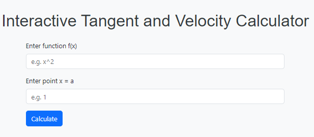
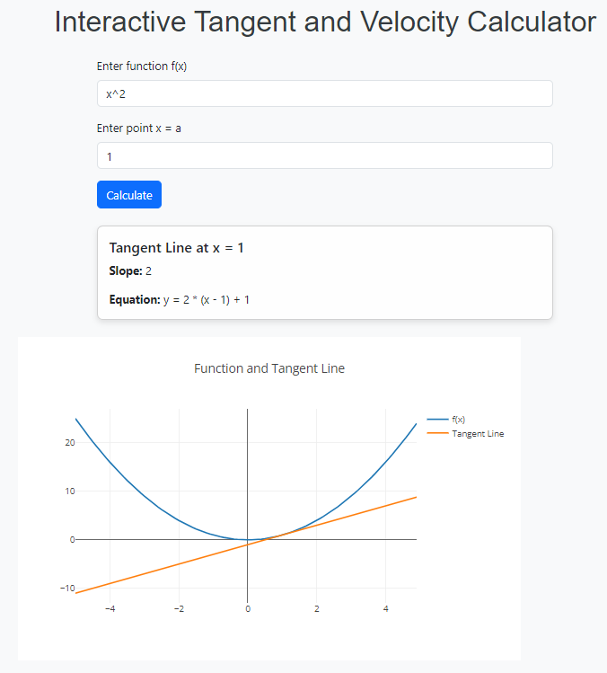
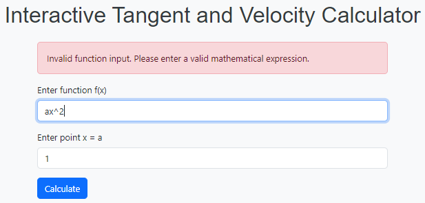

# Interactive Tangent and Velocity Calculator

## Description

This web application allows users to input a mathematical function and a specific point to calculate and visually display the tangent line at that point. Additionally, it can calculate the instantaneous velocity for a given position function over a specified time interval. The application is built using React.js and utilizes Math.js for function parsing and evaluation, and Plotly.js for interactive visualizations.

## Features

- **Function Input**: Input fields for the user to enter a function \( f(x) \) and a specific point \( x = a \).
- **Tangent Line Calculation**: Calculates the slope of the tangent line at \( x = a \) using the limit definition and displays the equation of the tangent line.
- **Velocity Calculation**: Input fields for the user to enter a position function \( s(t) \) and a specific time \( t \). Calculates the instantaneous velocity at the specified time.
- **Visualization**: Plots the function \( f(x) \) and the tangent line on a graph. Plots the position function \( s(t) \) and shows the velocity vector.
- **Interactive Elements**: Allows users to move the point \( x = a \) and see how the tangent line changes. Allows users to adjust the time \( t \) and see how the velocity changes.
- **Error Handling**: Validates inputs and displays error messages for invalid inputs.

## Design

The application is designed with a clean and simple UI using Bootstrap for styling. The layout is responsive and user-friendly, providing a seamless experience on both desktop and mobile devices.

### Components

1. **FunctionInput**: Component for inputting the function and point.
2. **TangentCalculator**: Component for calculating and displaying the tangent line.
3. **Graph**: Component for plotting the function and tangent line.
4. **VelocityCalculator**: Component for calculating and displaying the instantaneous velocity.

### Technologies Used

- **React.js**: Frontend framework for building user interfaces.
- **Math.js**: Library for mathematical calculations and function parsing.
- **Plotly.js**: Library for creating interactive graphs and visualizations.
- **Bootstrap**: CSS framework for styling and responsive design.

## Inputs and Outputs

### FunctionInput Component

#### Inputs

- **Function**: A mathematical function \( f(x) \).
- **Point**: A specific point \( x = a \).

#### Outputs

- **Error Message**: Displays an error message if the input is invalid.
- **On Calculate**: Triggers the calculation of the tangent line and slope.

### TangentCalculator Component

#### Inputs

- **Function Input**: The mathematical function \( f(x) \).
- **Point**: The specific point \( x = a \).

#### Outputs

- **Slope**: The slope of the tangent line at \( x = a \).
- **Tangent Line Equation**: The equation of the tangent line at \( x = a \).

### Graph Component

#### Inputs

- **Function Input**: The mathematical function \( f(x) \).
- **Point**: The specific point \( x = a \).
- **Slope**: The slope of the tangent line at \( x = a \).

#### Outputs

- **Graph**: A plot of the function \( f(x) \) and the tangent line at \( x = a \).

## Getting Started

### Prerequisites

- Node.js and npm installed on your machine.

## Getting Started

### Prerequisites

- Node.js and npm installed on your machine.

### Installation

1. Clone the repository:

```bash
git clone https://github.com/shreyapatill/Calculus-1.git
```

2. Navigate to the project directory:

```bash
cd Calculus-1
```

3. Install the dependencies:

```bash
npm install
```

4. Start the application:

```bash
npm start
```

5. Open your browser and go to `http://localhost:3000`.

## Screenshots

### Home Page



### Tangent Line Calculation



### Error Handling



## Contributing

Contributions are welcome! Please open an issue or submit a pull request.

## License

This project is licensed under the MIT License - see the [LICENSE](LICENSE) file for details.
